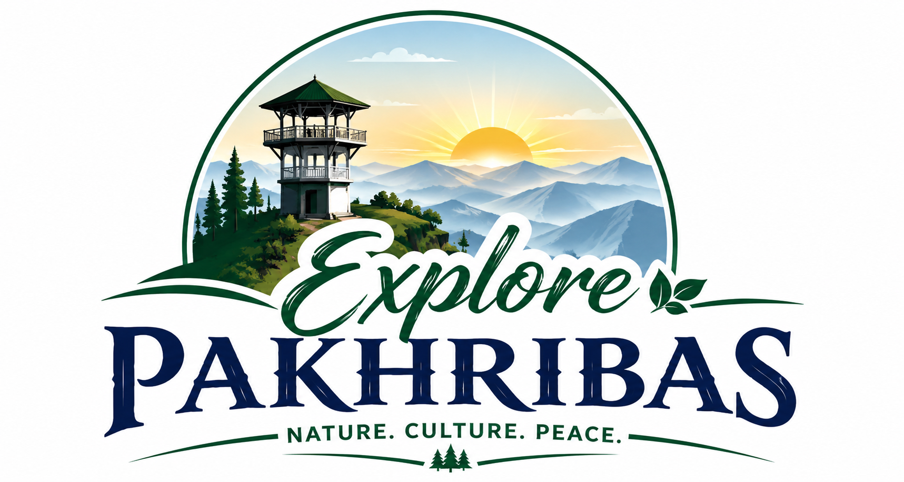
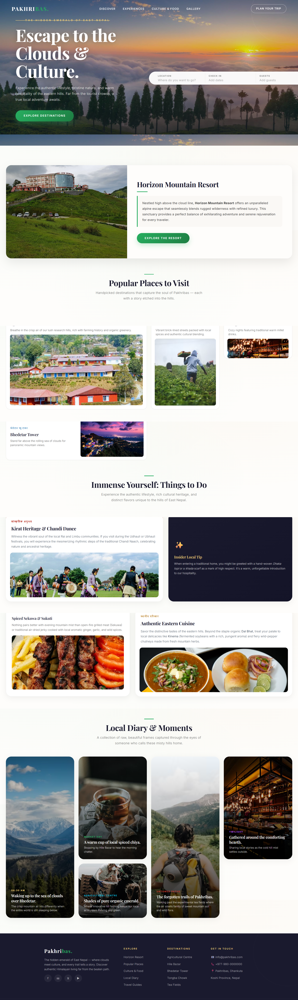

<div align="center">
  
  <br><br>
  <h1>🌿 Pakhribas — The Hidden Emerald of East Nepal</h1>
  <p>
    <em>A single‑page visual journey through the misty hills, vibrant culture, and untold stories of Pakhribas, Nepal.</em>
  </p>
  <br>
  
  
  
  
  
  <br><br>
</div>

---

## 🗻 A Glimpse of Pakhribas

Nestled in the eastern hills of Nepal, **Pakhribas** remains one of the country's best‑kept secrets. Far from the crowded trekking routes, it offers pristine nature, ancient Kirat traditions, and the warmest hospitality. This project captures that spirit — turning a simple travel page into a **narrative‑driven, visually poetic homepage**.

The design follows a **Japanese‑inspired Bento Grid** philosophy: each card feels like a carefully placed piece in a lunch box, where every image and every word has room to breathe.

<br>

<div align="center">
  
  <p><sub>A clean, story‑first layout — built to feel like turning pages of a travel journal.</sub></p>
</div>

---

## ✨ What Makes It Special

| Aspect | Description |
|--------|-------------|
| 🎋 **Bento Grid Layout** | Asymmetric, modular card system (`span-2-col`, `span-2-row`) that mimics the rhythm of Japanese lunch boxes. |
| 📖 **Story‑Driven Sections** | Three distinct chapters — *Places*, *Culture & Cuisine*, *Local Diary* — that guide the visitor through Pakhribas. |
| 🎨 **Minimalist Aesthetics** | Earthy palette (emerald, warm gold, indigo), serif headings, and generous whitespace that let the imagery shine. |
| ⚡ **Subtle Animations** | Scroll‑triggered reveals, hover‑state lifts, and smooth transitions that reward exploration without overwhelming. |
| 📱 **Fully Responsive** | Adapts gracefully from large desktop screens to mobile devices, preserving the bento feel at every breakpoint. |
| 🧭 **Fixed Navigation** | Transparent‑to‑glass navbar that stays accessible, with smooth‑scroll links to each story section. |

---

## 🧱 Project Structure

```
Web-Page/
├── index.html           # Initial commit page
├── pakhribas1.html      # Full homepage with Hero, Nav, Sections, Footer
├── parkhribas.html      # Alternative story‑focused layout
├── preview.png          # Repository preview / banner image
└── README.md            # You are here ✨
```

> **Note:** The main showcase files are `pakhribas1.html` (full homepage) and `parkhribas.html` (story layout). All images are linked from reliable CDNs so the pages work instantly without any build step.

---

## 🚀 Quick Start

1. **Clone the repository**
   ```bash
   git clone https://github.com/c25il027suman-oss/Web-Page.git
   cd Web-Page
   ```

2. **Open in your browser**
   ```bash
   open pakhribas1.html
   ```
   Or simply double‑click any `.html` file — no server required.

3. **Customize**
   - Replace placeholder image URLs with your own photography.
   - Update footer contact details and social links.
   - Adjust colors in the `:root` CSS block to match your brand.

---

## 🖌️ Design Philosophy

> *"Less is more — but every element must carry meaning."*

- **Typography**: `Cormorant Garamond` for poetic headings, `Inter` for clean body text.
- **Color**: Rooted in nature — emerald greens echo the hills, warm gold reflects local spices and harvests.
- **Motion**: Animations serve the story. Cards rise into view like fog lifting from the valleys.
- **Space**: Generous padding and negative space allow each card to breathe, reflecting the tranquility of the mountains.

---

## 📸 Image Credits

All images used in the demo are for educational / portfolio purposes and belong to their respective owners:

- Horizon Mountain Resort — via Twitter / PBS
- Agricultural Centre — via Nepal Traveller
- Hile Bazar, Misty Hills, Local Chai — Unsplash
- Bhedetar Tower — Wikimedia Commons
- Chandi Dance — Online Khabar

> If you plan to use this commercially, please replace them with your own licensed photographs.

---

## 🛠️ Tech Stack

- **HTML5** — Semantic structure with accessible landmarks
- **CSS3** — Custom properties, CSS Grid, flexbox, keyframe animations
- **Vanilla JavaScript** — Intersection Observer for scroll reveals, mobile menu toggle, smooth scrolling
- **Google Fonts** — Cormorant Garamond & Inter

---

## 🌐 Live Demo

<div align="center">
  <a href="https://c25il027suman-oss.github.io/Web-Page/" target="_blank">
    
  </a>
</div>

---

## 🤝 Contributing

This project is primarily a design showcase, but suggestions and improvements are always welcome!

1. Fork the repository
2. Create your feature branch (`git checkout -b feature/amazing-idea`)
3. Commit your changes (`git commit -m 'Add some amazing idea'`)
4. Push to the branch (`git push origin feature/amazing-idea`)
5. Open a Pull Request

---

## 📜 License

MIT © [Suman OSS] — Feel free to use, modify, and share. Attribution appreciated but not required.

<br>

<div align="center">
  <p>🌄 <strong>Pakhribas</strong> — where every trail holds a story, and every misty morning feels like a new beginning.</p>
  <p><sub>Made with ❤️ in the hills of East Nepal</sub></p>
</div>
